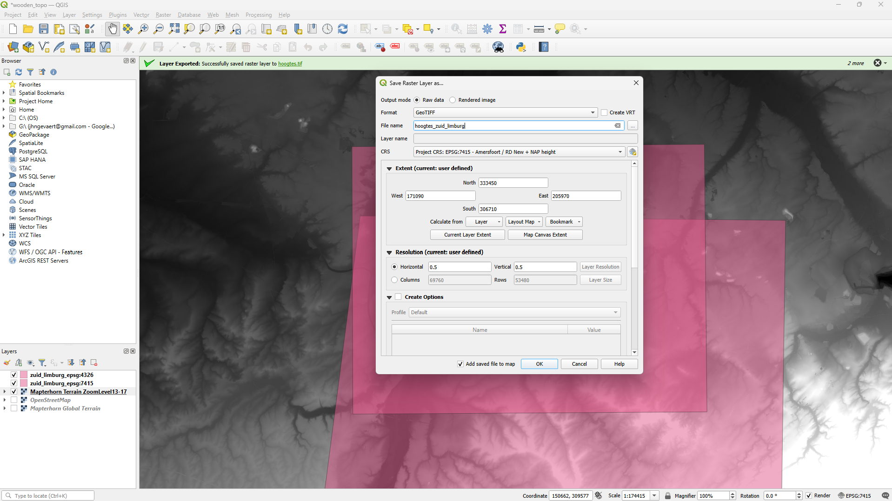

# Make 3D topography from lasered wood

## Get topography from Mapterhorn

### Download a pmtiles file for a given bbox

1. Download the pmtiles command line tool from the GitHub releases page: <https://github.com/protomaps/go-pmtiles/releases>
2. Put the executable in this folder
3. Determine the desired bouding box, e.g. with <https://boundingbox.klokantech.com>
  `bbox=min_lon,min_lat,max_lon,max_lat=5.615151,50.750133,6.113109,50.988467` EPSG:4326  
  `bbox=min_east,min_north,max_east,max_north=171090,306710,205970,333450` EPSG:7415
  `dx,dy=34880,26740`
4. Determine the right High resolution .pmtiles for your bounding box on <https://mapterhorn.com/coverage>
  `6-33-21.pmtiles`
5. Run your `pmtiles` command

```powershell
.\pmtiles.exe extract --bbox=5.615151,50.750133,6.113109,50.988467 https://download.mapterhorn.com/6-33-21.pmtiles 6-33-21.pmtiles
```

### Use QGIS to extract a GeoTIFF

1. Add the Mapterhorn topo as XYZ Tiles
2. Right-click the Mapterhorn XYZ Tiles layer > Export > Save As...
3. Then set the desired CRS, raster extends and horizontal (x) and vertical (y) resolution. Note the units of the horizontal and vertical resolution are the same as the selected CRS. So, degrees for geodetic CRSes, and meters for projected CRSes.



## Converting raster to topo mesh

| Format | Native Quads/n-gons | ASCII Size | Binary Size                     | Best Use                                         |
| ------ | ------------------- | ---------- | ------------------------------- | ------------------------------------------------ |
| PLY    | ✅ Yes             | Large      | Smallest (~0.7MB for 20k faces) | Scientific data, vertex colors china-sheetmetal​ |
| OBJ    | ✅ Yes             | Largest    | N/A (rarely binary)             | Rendering w/ textures china-sheetmetal​          |
| STL    | ❌ Triangles only  | Medium     | Small (~1MB for 20k faces)      | 3D printing only china-sheetmetal​               |


